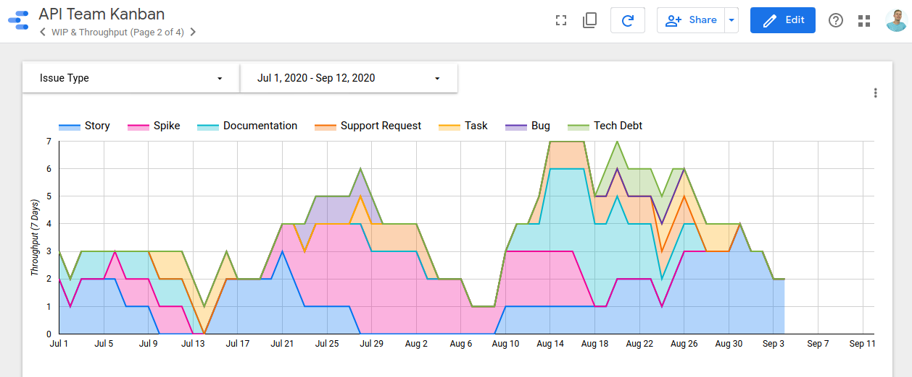

# Jira for Google Data Studio (Community Connector)

Google Data Studio connector for Jira that crunches kanban stats. It has two parts: The javascript part in the `google` directory is what is loaded into the Google Apps Script platform and connects directly into data studio itself. The part in `serverless` is an AWS lambda application written in Ruby that does the actual number crunching and heavy lifting.



## Development & Running Tests

Only the ruby part has tests because it is the only part that does any "real" work and contains all the logic. The javascript art is really just a pass-through interface for data studio to pull stats from the API.

First, ensure you have the right ruby version installed via `.ruby-version`; ensure bundler is available then install gems using `bundle`. Note that the gems are only used for running tests - the only gem the production code uses is the AWS SDK which is automatically bundled on any Ruby lambda by AWS itself and it is not actually uploaded using this application.

Run tests using `ruby ./run_all_specs.rb` - the tests use the minitest framework.

## Deployment

### Google Part

To deploy the javascript part in the `google` directory, you will need the CLI tool "[clasp](https://github.com/google/clasp)". Install it, follow the instructions to login, then you can deploy using `clasp push`. If you need to re-create the script for any reason you can do so using `clasp create --title "Jira Data Studio Connector"`.

### AWS Part

This part of the application uses the [serverless framework](https://www.serverless.com/framework/docs/). Install the CLI tool, login to AWS, and then use `serverless deploy` to push changes. By default, it will deploy to the stage "dev" for development. If you want to deploy to the production stage, use the stage flag to do it:

```
serverless deploy --stage prod
```

## Useful reference material

Google Data Studio development:

* [Interface reference](https://developers.google.com/datastudio/connector/reference) (what you need to implement)
* [Developer guide](https://developers.google.com/datastudio/connector)
* [Example implementations](https://github.com/googledatastudio/community-connectors) of data studio connectors, written by Google
* [Walkthrough of developing a connector](https://codelabs.developers.google.com/codelabs/community-connectors)
